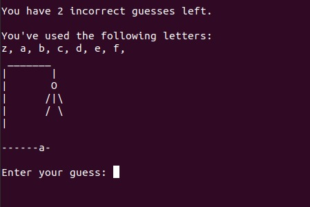

# C++ repository for studies.

Repository for studying C++ and creating games. Below is a list of some games created

## Games

### 01 - Guess the Number
[guessTheNumber](/games/guessNumber.cpp)

Guess the number it's a game where the player has to guess the random number generated by the computer. Depending on the difficulty, you will have n attempts to nail the number.

### 02 - Hangman

[hangman](/games/hangman.cpp)

In the Hangman program, the computer picks a secret word and the player tries to guess it one letter at a time. The player is allowed eight incorrect guesses. If he or she fails to guess the word in time, the player is hanged and the game is over.

### 03 - Tic-Tac-Toe
[tictactoe](/games/tictactoe.cpp)

In this game you will be face to face against the machine in a world match of Tic-Tac-Toe. Good luck